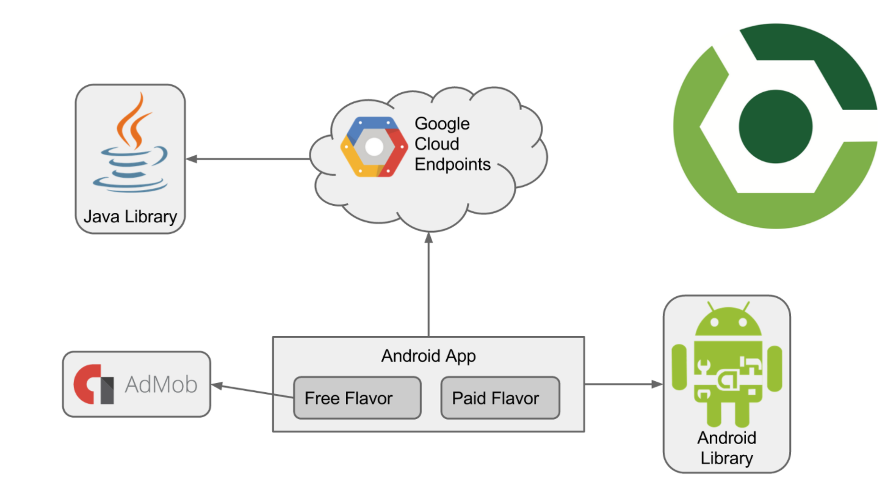

# Udacity Android Developer Nanodegree - Projeto 5 (Build It Bigger)

Este é um projeto multi-modular que tem como objetivo o uso de diferentes biliotecas (Java/Android) e um servidor backend [Google Cloud Endpoints (GCE)](https://cloud.google.com/endpoints/) para prover dados para um app Android que possui diferentes _flavors_ (_free_ e pago) para exibição ou não de anúncios usando o serviço [Google AdMob](https://admob.google.com/home/).

Com isso, temos 4 módulos:
- Uma biblioteca Java que fornece piadas aleatórias
- Um projeto configurado no GCE que instancia um backend local para servir as piadas da biblioteca acima
- Uma biblioteca Android que contém uma `Activity` para exibir as piadas
- App Android que consulta as piadas do backend e as repassa para serem na biblioteca Android

Além disso, foram configurados alguns testes de integração no Gradle para interagir com todos os módulos.

## Instalação:
- Faça um clone do repositório
- Importe a pasta como um novo projeto no [Android Studio](https://developer.android.com/studio/)
- Siga [essas instruções](https://github.com/udacity/ud867/tree/master/FinalProject#step-3-setup-gce) para instalar e configurar o GCE
- Configure um [emulador](https://developer.android.com/studio/run/emulator) ou conecte um [celular com USB debug ativado](https://developer.android.com/studio/run/device)
- Execute apartir do menu "Run"

## Copyright

Esse projeto foi desenvolvido por Márcio Souza de Oliveira em 09/02/2017.
